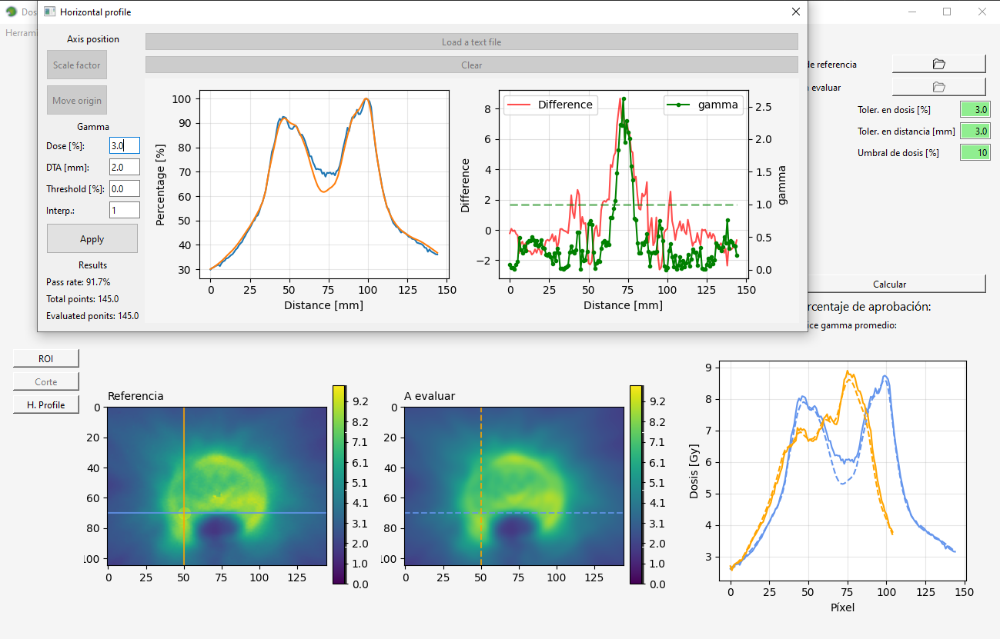

=========
Changelog
=========

v 0.10.1 (APR-2025)
-------------------

Issue
^^^^^

* DoseConverter class from Tiff2dose module issue on _get_zero_dose_intensity() method. Lateral ROI center now uses culumn instead of row of the labeled film.

v 0.10.0 (APR-2025)
-------------------

New Features
^^^^^^^^^^^^

* New fast method for quantitative evaluation of dose distributions based on Bakai's work, the Chi metric.(`DOI 10.1088/0031-9155/48/21/006 <10.1088/0031-9155/48/21/006>`_).

Issue
^^^^^

* Fixed wrong documentation ArrayImage.gamma method: 
* Maximum is calculated from the evaluated dose distribution, not the reference one.
* Local_norm parameter changes to local_dose to avoid confusion. Normalization is not performed in the method.

v 0.9.1 (MAR-2025)
------------------

Issue
^^^^^

* Now, it is possible to read dicom files as bytes.

v 0.9.0 (MAR-2025)
------------------

New Features
^^^^^^^^^^^^

* New crop_using_ref_position function to allow matching film and dicom images based on a reference position.

v 0.8.2 (MAR-2025)
------------------

Issue
^^^^^

* Fixed wrong documentation and error message when using ArrayImage.reduce_resolution_as() method. An error message occurs if the image has a smaller resolution than the reference image. Thank you Josip Atelj for the correction.
* Fixed wrong documentation about the number of pixels used to equate resolution. The number of pixels to average is given by image_resolution / reference_resolution.

Change
^^^^^^

* The PySide6 library is removed from requirements sice it is not a core dependency. If requiered, it can be installed.

v 0.8.1 (FEB-2025)
------------------

Issue
^^^^^

* Updating scikit-image to 0.25, in order to use skimage.morphology.footprint_rectangle instead of square. Square will be removed in version 0.27.

v 0.8.0 (FEB-2025)
------------------

Improvements
^^^^^^^^^^^^
* Lateral scanner response correction.
* Uncertainty analysis.
* Automatic quality control test between scanned images.
* Improved algorithm for automatic film detection.

Improvements for development
^^^^^^^^^^^^^^^^^^^^^^^^^^^^
* New LUT class in the calibration module, used to manipulate data for film calibration. The class is an adoption of the LUT class from `OMG Dosimetry package <https://omg-dosimetry.readthedocs.io/en/latest/_modules/omg_dosimetry/calibration.html#LUT>`_
* Tiff2Dose module uses the DoseConverter interface to handle conversion to dose using different channels or fit functions.
* Dosepy uses MIT license on the belief that open source is better science.

Issue
^^^^^
* In Dosepy GUI, changed settings by the user were not updated in the application.

Change
^^^^^^
* In the image module, TiffImage.get_labeled_objects() was replaced with TiffImage.set_labeled_films_and_filters() method.
* In the image module, load_images was replaced with load_multiples function. The to_dose() and dose_in_central_rois() methods were deleted.
* In the calibration module, the Calibration class was deleted to use the LUT class instead.

v 0.7.0 (SEP-2024)
------------------

Improvements
^^^^^^^^^^^^
* The app now allows storing configuration settings for film calibration (with a .toml file).
* New functionalities for the GUI, like buttons for dose image manipulation.
* New method for resolution management, called reduce_resolution_as(). The user can now reduce the resolution of some images to match the resolution of a reference one (useful for gamma analysis).
* README update to be user-friendly for Python developers.

Improvements for development
^^^^^^^^^^^^^^^^^^^^^^^^^^^^
* New name and new functionalities for build_and_installing.sh file. Now it is called packaging_installing_testing.sh and it is used to build, install, and test the package.
* Better management of dependencies using pyproject.toml file.
* First steps with Test-Driven Development.

Refactor
^^^^^^^^
* The equate() function from tools.files_to_image module is now called equate_array_size().

Issue
^^^^^
* There is no function called equate_images() in Dosepy.image module, as it was stated in the readthedocs documentation. To solve this, a new method called reduce_resolution_as() is created as a method of the ArrayImage class.
* _equate_height() function from tools.files_to_image module did not work properly. It is now fixed.
* Dosepy.old.gui_components.Bloque_Imagenes used a float for the axes.set_xdata() method instead of a sequence.

V 0.6.4 (JUN-2024)
------------------

Issue
^^^^^

* Loading TIFF files with the same size but different names were merged.

V 0.6.3 (JUN-2024)
------------------

Improvements
^^^^^^^^^^^^

* New functions to equate and stack images of different sizes (adapted from OMG_Dosimetry and pylinac). They are useful if each film has been scanned in separate TIFF images.

Issue
^^^^^

* Save button for calibration now saves the file in the correct folder.

V 0.6.2 (MAY-2024)
------------------

Improvements
^^^^^^^^^^^^
* New *clip* parameter for *to_dose* method to limit the maximum dose (useful for brachytherapy film dosimetry).
* New *exclude_above* parameter for *gamma2D* method. Any point in the evaluated distribution greater than exclude_above is not accounted for in the pass rate.
* set_labeled_img method from TiffImage uses a default threshold of 90% for film identification. Previously, it used threshold_otsu but was not useful for tif images where there is a small region of empty area relative to the film area.

Issue
^^^^^
* Now it is possible to open many tif files when the Browse button is clicked in Dosepy.app.

V 0.6.1 (APR-2024)
--------------------

New Features
^^^^^^^^^^^^

* New graphical user interface (GUI), using Model-View-Controller architecture.
* The number of films, their size and dose imparted to each of them can be defined by the user.
* Once a tif file is loaded, films are automatically detected.
* Average multiple scans of the same film to increase signal-to-noise ratio.

Improvements
^^^^^^^^^^^^

* The gamma2D method from ArrayImage class is adapted from the previous Dosepy.dose module.
* The load function (an extension from `pylinac <https://pylinac.readthedocs.io/en/latest/core_modules.html#pylinac.core.image.load>`_), supports DICOM files used for dose distributions (RD.dcm from Eclipse treatment planning system).
* PyPI README and gamma2D method are translated to English.

Breaking Change
^^^^^^^^^^^^^^^

* The new GUI focuses just on film dosimetry. Gamma index analysis requires a Python script. 

V 0.5.1 (FEB-2024)
------------------

* Fix issue with *_is_RGB* and *load* functions in tools.image module.

V 0.5.0 (JAN-2024)
------------------

* New image, calibration and i_o modules with new functionalities. The content is heavily inspired from `pylinac <https://pylinac.readthedocs.io/en/latest/>`_ and `OMG_dosimetry <https://omg-dosimetry.readthedocs.io/en/latest/>`_ libraries.
* First steps using unittest and flake8. 
* Use of scikit-image for auto film detection.
* Documentation for Getting stated with scripting.

V 0.4.0 (AUG-2023)
-------------------

* On the GUI, dose objects are created after loading. 
* When a csv file is open, a new window shows to ask for resolution.
* Quality control tests for new versions or post installation acceptance.
* New tool for horizontal profile analysis, based on `relative_dose_1d. <https://github.com/LuisOlivaresJ/relative_dose_1d package>`_

V 0.3.8 (MAY-2023)
-------------------

* Firsts steps for spanish to english documentation using Read The Docs Documentation.

V 0.3.7 (MAR-2023)
--------------------

* Se resuelve `error <https://github.com/LuisOlivaresJ/Dosepy/issues/32>`_ de ejecución con archivos de prueba. Se define una vecindad de 2 cm x 2 cm para reducir el tiempo de cálculo para el índice gamma. En la `página principal <https://luisolivaresj.github.io/Dosepy/>`_ de Dosepy, se muestra la validación para la dosimetría con película al medir los factores de campo de un haz 6FFF.

V 0.3.6 (FEB-2023)
------------------

* Se modifica el algoritmo de dosimetría con película. Se agrega Notebook para dosimetría con película. En la evaluación gamma, se habilita la opción para definir la dosis máxima como el percentil 99.1 de la distribución de dosis a evaluar. Se agrega información referente al uso no clínico del software Dosepy.

V 0.3.3-5 (JAN-2023)
--------------------

* Se modifican los nombres de los archivos y las clases para facilitar el mantenimiento del paquete. Se agrega guía de uso con Jupyter-Notebook.

V 0.3.2 (SEP-2022)
------------------

* Se inhabilita como primera opción el botón para abrir la distribución de dosis a evaluar. Se inhabilita el botón para calcular la distribución gamma si los parámetros ingresados por el usuario no son valores numéricos. Lo anterior para evitar un error de ejecución. 

V 0.3.1 (OCT-2022)
------------------

* Se actualiza la licencia. Se facilita la instalación al agregarse automáticamente las dependencias como numpy, matplotlib, etc. Se agrega información del tamaño de las distribuciones de dosis cuando se comparan matrices con diferentes dimensiones. Al guardar una distribución de dosis, se resuelve el error de generarse el nombre del archivo con doble formato (por ejemplo file.csv.csv). Se mejora el ingreso del parámetro "Ref." para ejecutar cambio de resolución solo cuando el valor ingresado por el usuario es un número flotante.

V 0.3.0 (JUL-2022)
------------------

* Se agrega un resumen del trabajo de validación del software. Se requiere de un password para utilizar el software.

Versión 0.2.3 (OCT-2021)
------------------------

* Se modifica la LICENCIA por derechos de autor. Se agrega video de presentación en congreso.

V 0.2.2 (OCT-2021)
------------------

* Se agrega el menú "Ayuda" para mostrar la versión y un link para la Documentación

V 0.2.1 (SEP-2021)
------------------

* Se agrega el menú "Herramientas" dentro de la interfaz gráfica para la dosimetría con película radiocrómica.

V 0.1.1 (AUG-2021)
------------------

* Se agrega la carpeta tools junto con la función *equalize* del modulo resol, para modificar la resolución espacial de una distribución e igualarla a una de referencia.

V 0.1.0 (AUG-2021)
------------------

* Se agrega una página web con instrucciones y documentación para el uso del paquete Dosepy.

V 0.0.8 (JUL-2021)
------------------

* Se agrega la posibilidad de usar una interfaz gráfica

V 0.0.4 (JUL)
-------------

* Se modifica el formato para el parámetro resolution. Se agregas indicaciones más detalladas para la instalación del paquete *Dosepy*

V 0.0.3 (JUL-2021)
------------------

* Se agregan las funciones from_csv y from_dicom para la lectura de datos.

V 0.0.1 (JUN-2021)
------------------

* *Dosepy* se incorpora al índice de paquetes python `PyPi <https://pypi.org/>`_.

01-MAY-2019
-----------

* *Dosepy* fue escrito por primera vez como parte de un desarrollo de `tesis <https://tesiunam.dgb.unam.mx/F/8V8RPCG2P1P85AN4XJ33LCS6CRT3NEL72J8IQQYUAKMESPGRGS-06398?func=find-b&local_base=TES01&request=Luis+Alfonso+Olivares+Jimenez&find_code=WRD&adjacent=N&filter_code_2=WYR&filter_request_2=&filter_code_3=WYR&filter_request_3=>`_ a nivel de Maestría en el año 2019, con el objetivo de comparar y evaluar distribuciones de dosis en radioterapia. Para ello se emplearon diferentes herramientas como perfiles, evaluación gamma e histogramas dosis volumen. La medición de las distribuciones de dosis se realizó con película radiocrómica EBT3.
