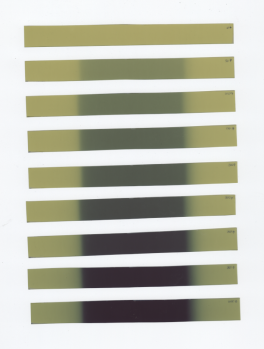

---
jupytext:
  formats: md:myst
  text_representation:
    extension: .md
    format_name: myst
kernelspec:
  display_name: Python 3
  language: python
  name: python3
---

# Film dosimetry

For film dosimetry, tif image must contain the irradiated film(s) and an unirradiated one, separated by a minimum distance of 5 mm between them. The color image should have three channels: red, blue and green (RGB).

This is a common example for film calibration.



## Film calibration

Start importing two libraries.

```{code-cell} python
from Dosepy.image import load
from pathlib import Path
```

Read the tif file used for film calibration and create a list with the imparted doses.

```{code-cell} python
file_path = Path("/home/luis/Descargas") / "POS48_1.tif"
cal_image = load(file_path, for_calib = True)

imparted_doses = [0, 0.5, 1, 1.5, 2, 3, 5, 8, 10]
```

Produce the calibration curve using the red channel, a central roi with size 16 mm width, 8 mm height and a rational fit function: $y = -c + \frac{b}{x-a}$.

```{code-cell} python
cal = cal_image.get_calibration(
    doses = imparted_doses,
    channel = "R", 
    roi = (16, 8),
    func = "RF"
    )
_ = cal.plot()
```

## Film to dose

Load another tif file

```{code-cell} python
qa_image_path = Path("/home/luis/Descargas") / "to_dose.tif"
qa_image = load(qa_image_path)
qa_image.plot()
```

Apply the calibration curve

```{code-cell} python
dose_img = qa_image.to_dose(cal)
```

Plot it

```{code-cell} python
import matplotlib.pyplot as plt
import numpy as np
fig, ax = plt.subplots(ncols=1)

max_dose = np.percentile(dose_img.array, [99.9])[0]
pos = ax.imshow(dose_img.array, cmap='nipy_spectral')
pos.set_clim(-.05, max_dose)

# add a colorbar
fig.colorbar(pos, ax=ax)
plt.plot()
```

Get mean doses from central rois, 20 mm width and 8 mm hight, in each founded films.

```{code-cell} python
doses_in_central_rois = qa_image.doses_in_central_rois(cal, roi = (20, 8), show=True)
print(doses_in_central_rois)
```

Save the dose distribution as a tif file (in cGy) useful for further analysis using [ImageJ](https://imagej.net/ij/).

```python
dose_img.save_as_tif("dose_in_tif_file")
```

Save as csv file

```python
np.savetxt(file_name, dose_img.array, fmt = '%.3f', delimiter = ',')
```