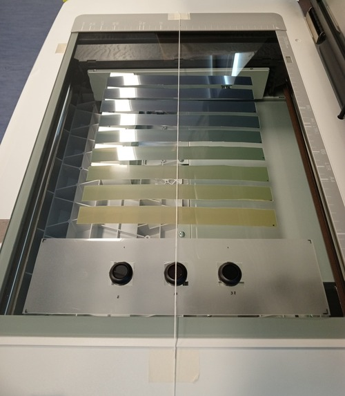

# General guidelines

The following recommendations aim to help the user to setup a protocol for film dosimetry based on a flatbed scanner with CCD sensors. For a more comprehensive analysis, it is recommended to read the [Task-Group 235](https://doi.org/10.1002/mp.14497) of the AAPM.

## Scanner commissioning

### Reference position

It is recommended to define a reference point on the lateral axis (direction parallel to the scanner lamp) to locate and quantify the effect of the lateral response of the scanner-film system.
The following figure shows the use of a thread to locate the center of the scanner along the scanning direction.

### Reproducibility

It is recommended to establish a baseline value for the scanner's response using one or more optical filters or a uniform object with stable optical density. Subsequently, every time a film is scanned, it is recommended to scan it along with the optical filter. This serves as a quality control measure to identify changes in the scanner's response over time or a possible inadvertent application of automatic image processing by the scanner software. In the previous image, three optical filters used in video cameras on a drone are shown.

### Warmup

It is recommended to perform a series of consecutive readings on the optical filter to evaluate the scanner's response to determine the waiting time and the number of scans to perform as a warmup before placing a film. Generally, it is recommended to turn it on 30 minutes in advance and perform 3 to 5 previews before the films to keep the scanner lamp on.

## Scanning films

### Handling

User should not touch the films without wearing gloves. 

### Turn off automatic processing

The user should identify in the scanner software how to disable automatic corrections, such as color, brightness, or contrast adjustments.

### Acquisition parameters

For most applications, it is recommended to use a color depth of 16 bits per channel (65,536 color tones) in RGB mode and a resolution of 72–75 dots per inch (dpi).

### Glass sheet

It is recommended to place a 3 mm glass sheet over the films for compression to create a flat surface.

### Labeling

It is recommended to label the films (at least a small mark on one corner of the film) to identify and maintain their orientation relative to the scanner bed.

### Waiting time after irradiation

A waiting time of 16–24 hours is commonly used and should be consistent with the established protocol.
