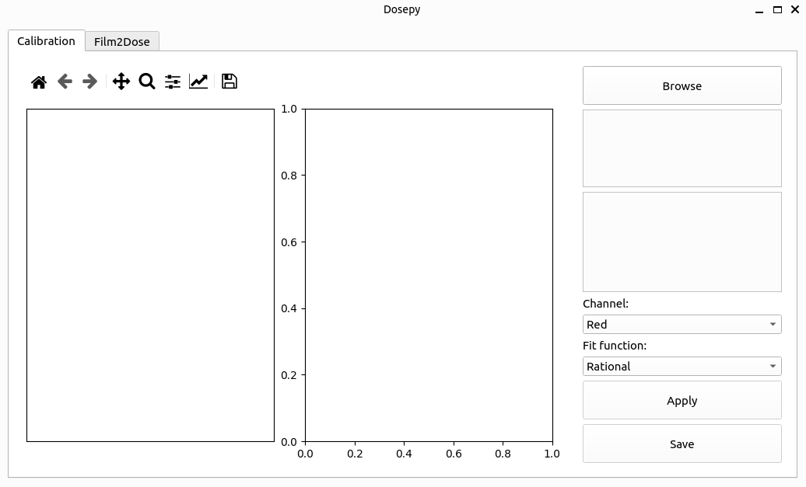

# Installation

If you are working with Python packages (for example Dosepy), it is a good practice to create virtual environments for your different applications to avoid python-packages dependency conflicts. To do that, first we need to install [Miniconda](https://docs.conda.io/en/latest/miniconda.html) (a python package manager). Once installed, open *Anaconda Prompt* (a black window) and write the following commands:


```python
conda create -n myenv python=3.12
conda activate myenv 
pip install Dosepy
```

1. The first line is used to create an environment named "myenv", with a specific version of Python: 3.11
2. The second line activates the created environment
3. The last one to install Dosepy

For more information about environments, [see this guide](https://conda.io/projects/conda/en/latest/user-guide/tasks/manage-environments.html#)

## Open Dosepy the GUI application

First start a python interpreter, for example running the python command:

```python
python
```

Once you see the symbol >>>, run the next command:

```python
>>> import Dosepy.app
```

The main window should be displayed


