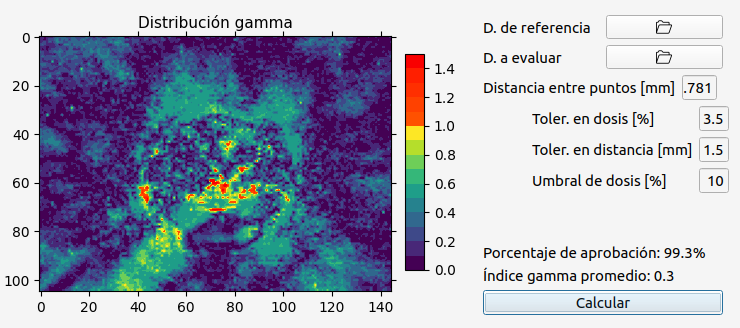
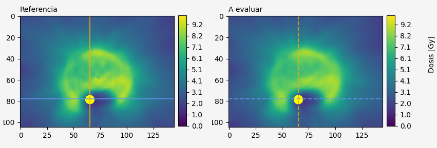
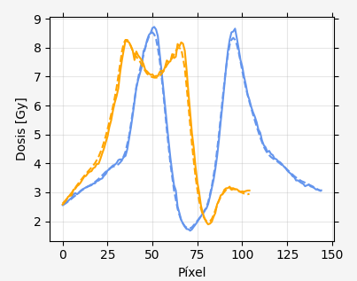
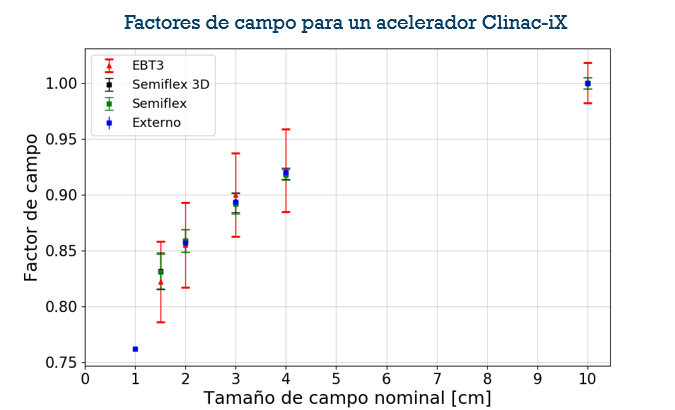

# Welcome to Dosepy


Dosepy is a python library to easly perform 2D/1D gamma analysis and film dosimetry used in radiotherapy. 

Dosepy takes two images (TIFF format) for calibration and two image for dose distribution analysis. After that, a DICOM file (typically exported from a treatment planning system) can be loaded to perform gamma index comparison.

Dose distribution can be in DICOM (.dmc) or text-csv (comma separated values) format.

```{note}
In order to generate easy-to-use software for users who use radiochromic film, the dose distributions to be analysed must meet the following characteristics:
* Film dose distributions must have the same physical dimensions and spatial resolution (equal number of rows and columns) with respect to the dose distribution to be compared. You can use {py:func}`Dosepy.tools.resol.match_resolution` function to manage array size changes.
* The distributions must be registered, that is, the coordinate of a point in the reference distribution must be equal to the coordinate of the same point in the distribution to be evaluated. To achieve this, [ImageJ](https://imagej.nih.gov/ij/download.html) is an excellent tool for cropping the region to be analyzed.
* Gray (Gy) and millimeters (mm) are the units used for absorbed dose and physical distance, respectively.
* The dicom file must contain only a 2D dose distribution.

```


## Dose comparison
### Gamma index



 Dose distributions comparison can be performed using the 2-dimensional gamma index test according to Low's definition {cite}`Daniel_Low_gamma_1998`, as well as some AAPM TG-218 {cite}`Miften_TG218_2018` recommendations:

* The acceptance criteria for dose difference can be selected in absolute mode (in Gy) or relative mode (in %).
  * In relative mode, the percentage could be interpreted with respect to the maximum dose (global normalization), or with respect to the local dose (local normalization); according to user selection.
* Dose threshold can be adjusted by the user.
* The reference distribution can be selected by the user.
* It is allowed to define a search radius as an optimization process for the calculation.
* By default, percentile 99 from dose distribution is used as maximum dose. This makes it possible to avoid the possible inclusion of artifacts or user labels in specific positions of the distribution (useful with radiochromic film).
* Interpolation is not yet supported.

### Dose profiles





It is also possible to compare two dose distributions using vertical and horizontal profiles. The origin of each profile must be selected with the help of a graphical user interface.

```{warning}
To use a software as a [medical device](https://www.imdrf.org/documents/software-medical-device-samd-key-definitions), it is required to demonstrate its safety and efficacy through a [risk categorization structure](https://www.imdrf.org/documents/software-medical-device-possible-framework-risk-categorization-and-corresponding-considerations), a [quality management system](https://www.imdrf.org/documents/software-medical-device-samd-application-quality-management-system) and a [clinical evaluation](https://www.imdrf.org/documents/software-medical-device-samd-clinical-evaluation); as described in the International Forum of Medical Device Regulators working group guidelines (IMDRF).

Dosepy is currently **under development** to meet quality standards. To achieve this in Mexico the regulatory mechanism is through NOM-241-SSA1-2021, in addition to the IMDRF guidelines.
```

## Algorithm validation

**Gamma index**

[Abstract](https://github.com/LuisOlivaresJ/Dosepy/blob/2bf579e6c33c347ef8f0cdd6f4ee7534798f0d13/docs/assets/validation.pdf)<br/>
The validation for the gamma index algorithm was carried out by comparing the results against the DoseLab 4.11 and VeriSoft 7.1.0.199 software. That work was presented at the 7th Congress of the Mexican Federation of Medical Physics Organizations in 2021. [(Video)](https://youtu.be/HM4qkYGzNFc).

**Film dosimetry**

Using EBT 3 radiochromic film, total dispersion factors (also known as Output factors) were measured for a 6 FFF beam from a Clinac-iX linear accelerator. Following the IAEA-AAPM TRS 483 code of practice, the results were compared with measurements from two ionization chambers. [The results](https://smf.mx/programas/congreso-nacional-de-fisica/memorias-cnf/) were presented at the LXIII National Physics Congress (2020).


## Discussion
Have questions? Ask them on the Dosepy [discussion forum](https://groups.google.com/g/dosepy).

```{tableofcontents}
```
