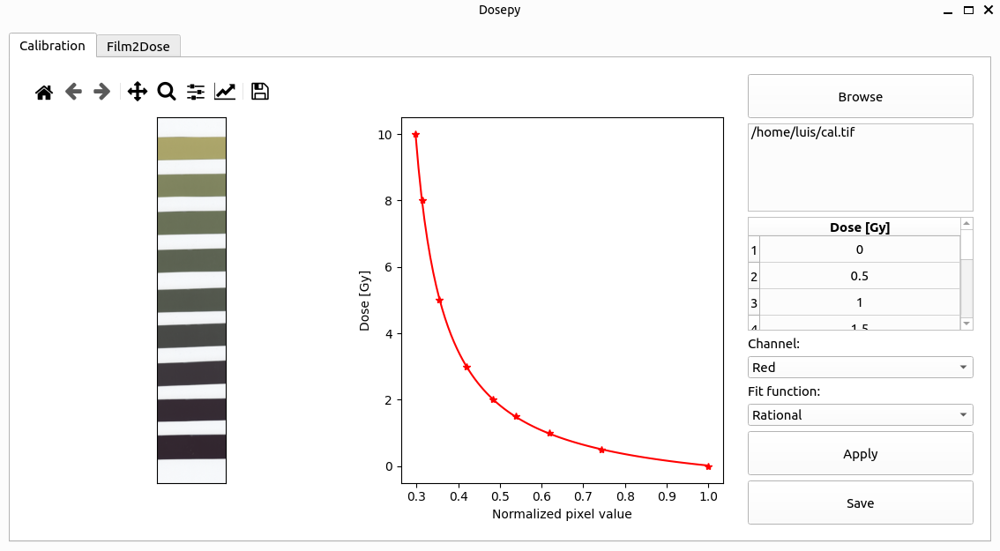

# Welcome to Dosepy

Dosepy is an open-source Python library to perform radiochromic film dosimetry.

Dosepy is intended to be an accessible tool for medical physicist in radiation oncology to perform film dosimetry with effortless.

## GUI

Dosepy has a graphical user interface to perform film dosimetry. Once a tiff file is loaded,
scanned films are **automatically detected**. 

## Features

* Uncertainty analysis.
* Quality control test for error detection.
* Multiple scans average for noise reduction.
* Lateral scanner response correction.
* Automatic film detection.

## Algorithm validation

**Film dosimetry**

Using EBT 3 radiochromic film, total dispersion factors (also known as Output factors) were measured for a 6 FFF beam from a Clinac-iX linear accelerator. Following the IAEA-AAPM TRS 483 code of practice, the results were compared with measurements from two ionization chambers. [The results](https://smf.mx/programas/congreso-nacional-de-fisica/memorias-cnf/) were presented at the LXIII National Physics Congress (2020).

## Scientific publications where Dosepy was used

Rojas-López, J. A., et al. (2024). Commissioning of MRI-guided gynaecological brachytherapy using an MR-linac. Biomedical Physics & Engineering Express, 10(5), 055032. doi: [10.1088/2057-1976/ad6c54](https://iopscience.iop.org/article/10.1088/2057-1976/ad6c54/pdf).

Rojas-López, J. A., Cabrera-Santiago, A., García-Andino, A. A., Olivares-Jiménez, L. A., & Alfonso, R. (2024). Experimental small fields output factors determination for an MR-linac according to the measuring position and orientation of the detector. Biomedical Physics & Engineering Express, 11(1), 015043. doi: [10.1088/2057-1976/ad9f67](https://iopscience.iop.org/article/10.1088/2057-1976/ad9f67)

## Discussion
Have questions? Ask them on the Dosepy [discussion forum](https://groups.google.com/g/dosepy).

## Warning

To use a software as a [medical device](https://www.imdrf.org/documents/software-medical-device-samd-key-definitions), it is required to demonstrate its safety and efficacy through a [risk categorization structure](https://www.imdrf.org/documents/software-medical-device-possible-framework-risk-categorization-and-corresponding-considerations), a [quality management system](https://www.imdrf.org/documents/software-medical-device-samd-application-quality-management-system) and a [clinical evaluation](https://www.imdrf.org/documents/software-medical-device-samd-clinical-evaluation); as described in the International Forum of Medical Device Regulators working group guidelines (IMDRF).

Dosepy is currently **under development** to meet quality standards. To achieve this in Mexico the regulatory mechanism is through [NOM-241-SSA1-2021](https://dof.gob.mx/nota_detalle.php?codigo=5638793&fecha=20/12/2021#gsc.tab=0), in addition to the IMDRF guidelines.
