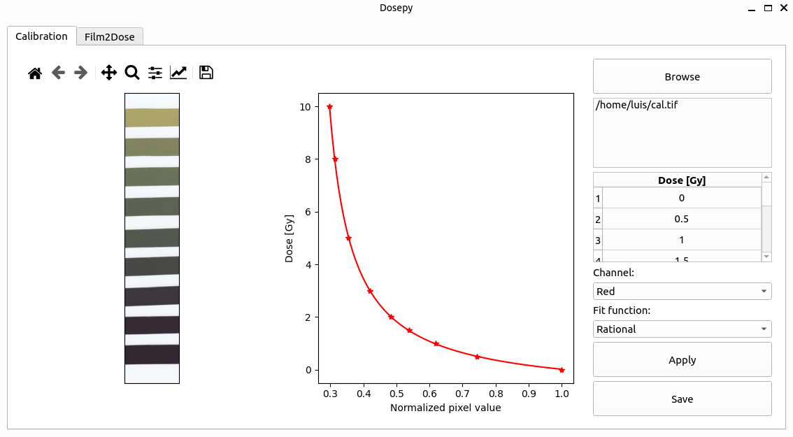

---
jupytext:
  formats: md:myst
  text_representation:
    extension: .md
    format_name: myst
kernelspec:
  display_name: Python 3
  language: python
  name: python3
---

# Getting started

## Using a GUI

The easiest way to use Dosepy is through a graphical user interface (GUI). Open a python interpreter (for example opening *Anaconda Prompt* and typing python) and import Dosepy.app as follows:

```python
import Dosepy.app
```

Click on the *Browse* button to load a tif file. The software will automatically find the scanned films. A table is then displayed to allow user's inputs for imparted doses to the films.

```{note}
ROI size, color channel and other parameters can be changed on settings.
```


