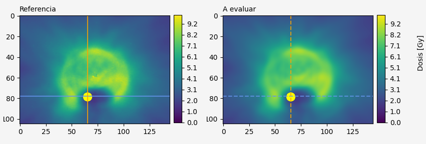

# Getting started



## Usign a GUI

The easiest way to use Dosepy is through a graphical user interface (GUI). Open a python interpreter (for example opening *Anaconda Prompt* and typing python) and import Dosepy.GUI as follows:

```python
import Dosepy.GUI
```

Dosepy has two pre-loaded with two dose distributions examples, to allow interaction with the available tools.

## Scripting

