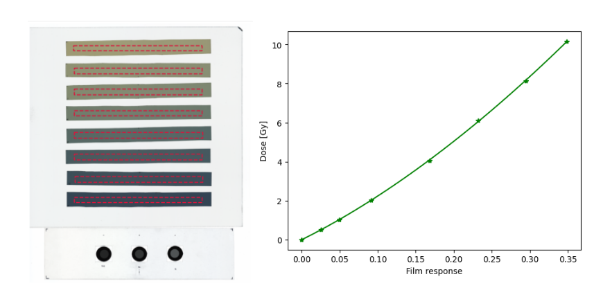
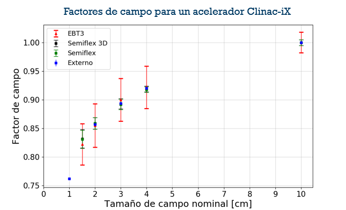

# Welcome to Dosepy

Dosepy is an open-source Python library to perform radiochromic film dosimetry.

Dosepy is intended to be an accessible tool for medical physicists in radiation oncology to perform film dosimetry effortlessly.

## Features

* Automatic film detection.
* Uncertainty analysis.
* Quality control test for error detection.
* Average of multiple scans for noise reduction.
* Handling of lateral scanner response artifacts.

## Algorithm validation

**Film dosimetry**

Using EBT 3 radiochromic film, total dispersion factors (also known as Output factors) were measured for a 6 FFF beam from a Clinac-iX linear accelerator. Following the IAEA-AAPM TRS 483 code of practice, the results were compared with measurements from two ionization chambers. [The results](https://smf.mx/programas/congreso-nacional-de-fisica/memorias-cnf/) were presented at the LXIII National Physics Congress (2020).

## Scientific publications where Dosepy was used

Rojas-López, J. A., et al. (2024). Commissioning of MRI-guided gynaecological brachytherapy using an MR-linac. Biomedical Physics & Engineering Express, 10(5), 055032. doi: [10.1088/2057-1976/ad6c54](https://iopscience.iop.org/article/10.1088/2057-1976/ad6c54/pdf).

Rojas-López, J. A., Cabrera-Santiago, A., García-Andino, A. A., Olivares-Jiménez, L. A., & Alfonso, R. (2024). Experimental small fields output factors determination for an MR-linac according to the measuring position and orientation of the detector. Biomedical Physics & Engineering Express, 11(1), 015043. doi: [10.1088/2057-1976/ad9f67](https://iopscience.iop.org/article/10.1088/2057-1976/ad9f67)

## Contributing

Thank you for your interest in contributing to Dosepy! We're excited to have you here and appreciate your help in making this library better for everyone.

Documentation is Key 🔑
Good documentation is the backbone of any successful open-source project. Whether you're improving examples, fixing typos, or adding new sections, your contributions will make a huge difference.

How You Can Help:

* Fix Typos or Errors: Found a typo or something unclear? Let us know!

* Improve Examples: Help us make the examples more practical and easy to understand.

* Add New Content: Missing documentation for a feature? Feel free to add it!

Need Help?
If you have any questions or need guidance, feel free to reach out by opening an issue on [GitHub](https://github.com/LuisOlivaresJ/Dosepy).

Let's make Dosepy the best it can be! 🚀

## Discussion
Have questions? Ask them on the Dosepy [discussion forum](https://groups.google.com/g/dosepy).

## Warning

To use software as a [medical device](https://www.imdrf.org/documents/software-medical-device-samd-key-definitions), it is required to demonstrate its safety and efficacy through a [risk categorization structure](https://www.imdrf.org/documents/software-medical-device-possible-framework-risk-categorization-and-corresponding-considerations), a [quality management system](https://www.imdrf.org/documents/software-medical-device-samd-application-quality-management-system), and a [clinical evaluation](https://www.imdrf.org/documents/software-medical-device-samd-clinical-evaluation); as described in the International Forum of Medical Device Regulators working group guidelines (IMDRF).

Dosepy is currently **under development** to meet quality standards. To achieve this in Mexico, the regulatory mechanism is through [NOM-241-SSA1-2021](https://dof.gob.mx/nota_detalle.php?codigo=5638793&fecha=20/12/2021#gsc.tab=0), in addition to the IMDRF guidelines.
